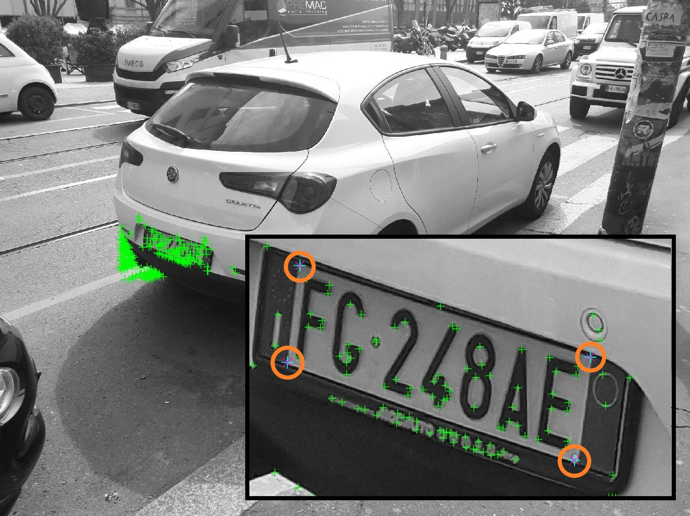
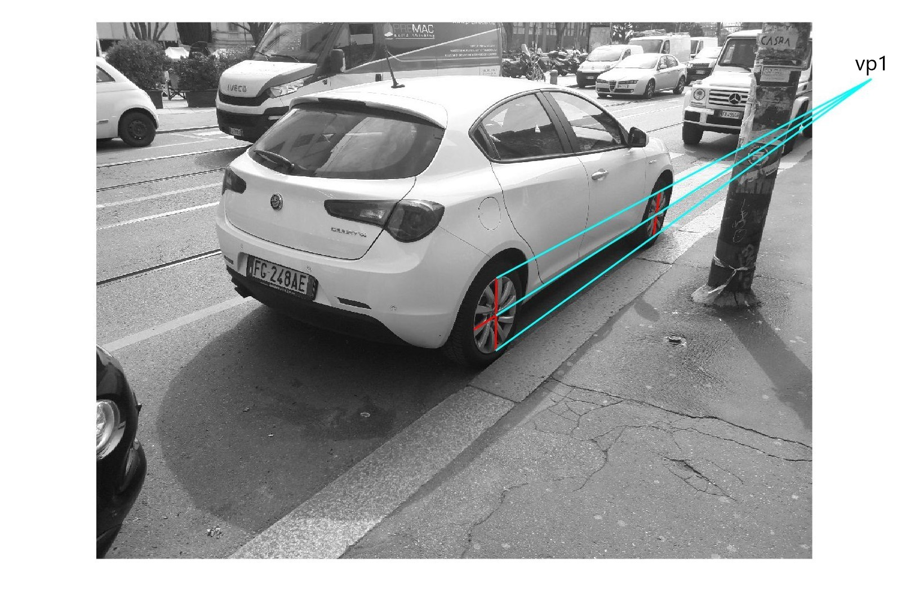
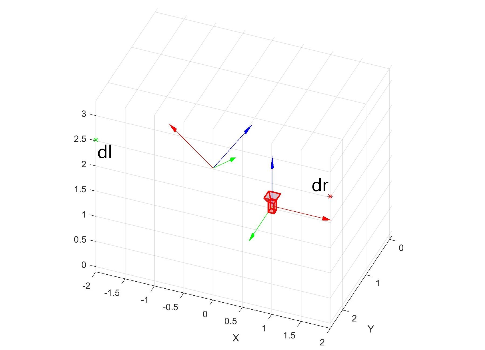

# Image Analysis and Computer Vision project

## Description

This is the Matlab code of the Image Analysis and Computer Vision course project.
The aim of the project was to practice the notions acquired during theoretical lessons. 

In particular, I accomplished the following tasks on a single image of a car: 
- Image extraction of keypoints features and ellipses detection (wheels of the car)
- Calculation of the ratio between the diameter of the wheel circles and the wheel-to-wheel distance: this is useful to recognize the car model
- Intrinsic calibration of the camera by determining the calibration matrix K (assuming a zero-skew but not natural camera)
- Reconstruction of the 3D position of symmetric pairs of features (like the vertex of the license plate) with respect to a reference frame fixed on the symmetry plane of the car
- Localization of the camera with respect to the previous reference frame

For a complete description of the project and usage details please refer to the [report](doc/documentation.pdf).

## Screenshots

Ellipses detected

Harris keypoints

Horizontal vanishing point

3D position of symmetric points

